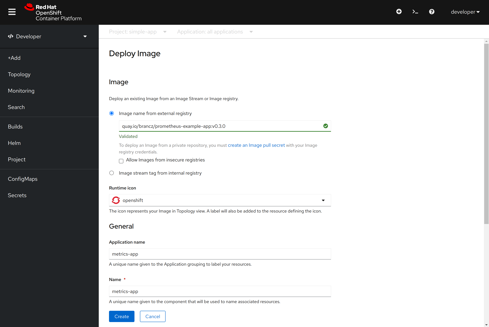
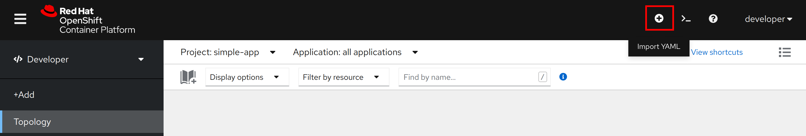
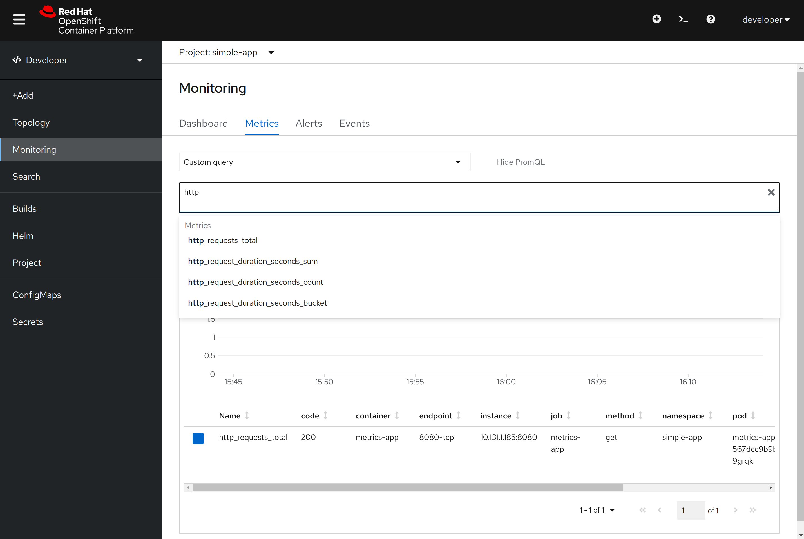
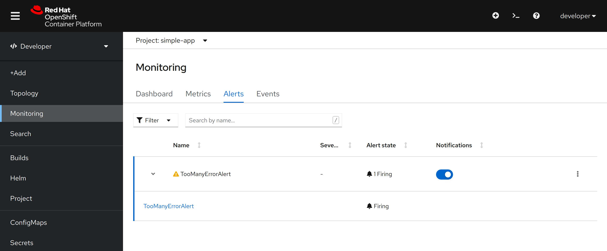

# Monitor a simple application

## Deploy the application

We will use the project `simple-app` to deploy a sample application to demonstrate how easy it is to leverage the user workload monitoring framework.

1. Login to the web console with the `developer` user and switch to the Developer perspective.
2. Click on the button _+Add_
3. Choose _Container Image_
4. Where it says _Enter an image name_, paste the following:

      ```bash
      quay.io/brancz/prometheus-example-app:v0.3.0
      ```

5. You can use anything in the box that says _Application Name_, but you __must__ put `metrics-app` in the box that says _Name_.

    The _Name_ value is used as the base unique identifier applied to all of the objects that end up deployed. For example, the Deployment will be called `metrics-app`.

6. Leave all other values at their defaults and click _Create_.



The `/metrics` URI of the `metrics-app` is serving the metrics that prometheus will scrape, you can check it by opening the `Route` created with the deploy:

```text
# HELP http_request_duration_seconds Duration of all HTTP requests
# TYPE http_request_duration_seconds histogram
http_request_duration_seconds_bucket{code="200",handler="found",method="get",le="0.005"} 2
http_request_duration_seconds_bucket{code="200",handler="found",method="get",le="0.01"} 2
http_request_duration_seconds_bucket{code="200",handler="found",method="get",le="0.025"} 2
http_request_duration_seconds_bucket{code="200",handler="found",method="get",le="0.05"} 2
http_request_duration_seconds_bucket{code="200",handler="found",method="get",le="0.1"} 2
http_request_duration_seconds_bucket{code="200",handler="found",method="get",le="0.25"} 2
http_request_duration_seconds_bucket{code="200",handler="found",method="get",le="0.5"} 2
http_request_duration_seconds_bucket{code="200",handler="found",method="get",le="1"} 2
http_request_duration_seconds_bucket{code="200",handler="found",method="get",le="2.5"} 2
http_request_duration_seconds_bucket{code="200",handler="found",method="get",le="5"} 2
http_request_duration_seconds_bucket{code="200",handler="found",method="get",le="10"} 2
http_request_duration_seconds_bucket{code="200",handler="found",method="get",le="+Inf"} 2
http_request_duration_seconds_sum{code="200",handler="found",method="get"} 4.6892e-05
http_request_duration_seconds_count{code="200",handler="found",method="get"} 2
# HELP http_requests_total Count of all HTTP requests
# TYPE http_requests_total counter
http_requests_total{code="200",method="get"} 2
# HELP version Version information about this binary
# TYPE version gauge
version{version="v0.3.0"} 1
```

## Monitor the application

We need to create a `ServiceMonitor` object to start monitoring our simple application.

```yaml
apiVersion: monitoring.coreos.com/v1
kind: ServiceMonitor
metadata:
  name: simple-app-monitor
spec:
  endpoints:
  - interval: 30s
    port: 8080-tcp
    scheme: http
  selector:
    matchLabels:
      app: metrics-app
```

:star: Notice the `matchLabels` block, we are referencing the name we used before.

Copy the yaml block and paste it into the web console by clicking on the "_plus_" button.



Now go to the _Monitoring_ Section of the web console and click on _Metrics_ to start query the data collected by Prometheus.

Select _Custom query_ from the drop-down menu and start to write _http_ into the _Expression_ box.

The available metrics are auto-completed, if auto-completion does not work, try to wait a few seconds to give prometheus the time to start scraping.



## Create a custom alert

We are going to demonstrate how easy it is to define an alert based on the metrics we are collecting from our `simple-app`

To define an alert we use the `PrometheusRule` Custom Resource:

```yaml
apiVersion: monitoring.coreos.com/v1
kind: PrometheusRule
metadata:
  name: example-alert
spec:
  groups:
  - name: example
    rules:
    - alert: TooManyErrorAlert
      expr: http_requests_total{code="404"} > 10
```

Copy the yaml above and paste it into the web console using the "_plus" button.

The Alert we just defined watch for requests whose response was 404 HTTP error, if the number exceeds 10, it will trigger.

To test it, open a web browser and open the `simple-app` route, use `/err` as the URI.

Hit the refresh button a couple of times, after a few seconds you should see the alert is firing on the web console.



Proceed with the next section: [Monitor a Jboss application](../2-Monitor-Jboss-EAP/README.md)
