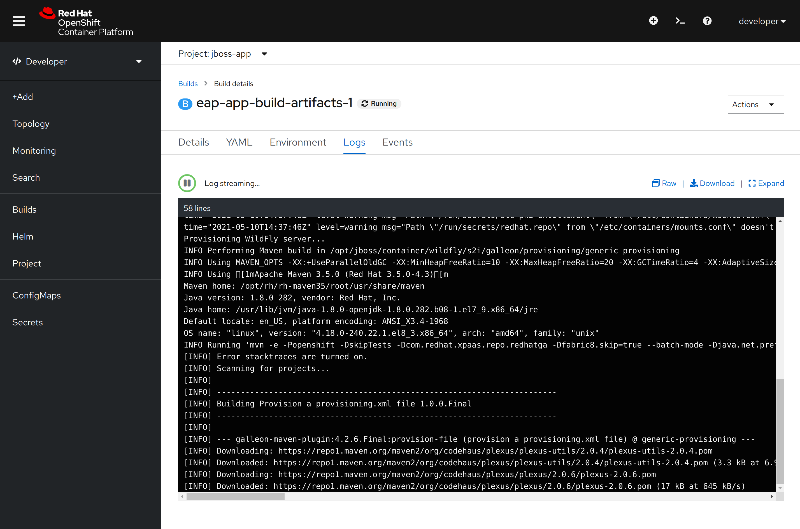

# Monitor a Jboss application

In the previous section we monitored a simple application, but a lot of middleware and frameworks are ready to expose their metrics for Prometheus.

Let's try to deploy a Jboss quickstart application to better understand what metrics are available and how to do it.

## Deploy the Jboss quickstart application

1. Switch to the `jboss-app` project using the drop-down menu of the web console in the Developer perspective.
2. Click on the _Add_ button on the left and select _From Catalog_
3. In the filter text box, write _jboss eap_
4. Click on _JBoss EAP 7.3 (OpenJDK 8)_
5. Click on _Instantiate Template_
6. Leave all the fields as they are, scroll to the bottom and click _Create_

An automated build of the code in the Jboss Quickstart github repo will be started, wait until the process finishes.

You can follow the process by navigating to the _Builds_ section of the Developer perspective:



The template uses [Source-to-Image (S2I)](https://access.redhat.com/documentation/en-us/red_hat_jboss_enterprise_application_platform/7.3/html-single/getting_started_with_jboss_eap_for_openshift_container_platform/index#deploy_eap_s2i) to build the code and create the container image that will be uploaded to the OpenShift internal registry.

The overall process should take less than 10 minutes to complete.

## Monitor the Jboss application

In order to monitor the Jboss application, we need to modify the `DeploymentConfig` created by the template to enable the Prometheus exporter since it is disabled by default.

1. To enable the Prometheus exporter we add an _environment variable_ to the `DeploymentConfig` by switching to the Administrator perspective.
2. Click on _Workloads_ to expand the menu
3. Click on _DeploymentConfigs_
4. You should have only one `DeploymentConfig` named `eap-app`, click on it
5. Click on _Environment_
6. Click on _Add more_ at the bottom of the page, a blank line should appear
7. Write `AB_PROMETHEUS_ENABLE` as the _NAME_
8. Write `true` as the _VALUE_
9. Scroll down to the bottom and click _Save_

The operation will trigger an update of our Jboss application, a new pod will be started with the new environment variable added to it.

:star: [Here](https://access.redhat.com/documentation/en-us/red_hat_jboss_enterprise_application_platform/7.3/html-single/getting_started_with_jboss_eap_for_openshift_container_platform/index#reference_configuration_environment_variables) you can find all the available environment variables.

Let's open a shell into the new pod to see what happened:

1. Click on _Pods_
2. Click on _Terminal_
3. When the terminal prompt is ready, write this command: `curl localhost:9799/metrics`

You will see something like this:

```text
# HELP jboss_transactions_number_of_nested_transactions_total Transactions Metrics number_of_nested_transactions
# TYPE jboss_transactions_number_of_nested_transactions_total counter
jboss_transactions_number_of_nested_transactions_total 0.0
# HELP jboss_transactions_number_of_resource_rollbacks_total Transactions Metrics number_of_resource_rollbacks
# TYPE jboss_transactions_number_of_resource_rollbacks_total counter
jboss_transactions_number_of_resource_rollbacks_total 0.0
# HELP jboss_transactions_number_of_timed_out_transactions_total Transactions Metrics number_of_timed_out_transactions
# TYPE jboss_transactions_number_of_timed_out_transactions_total counter
jboss_transactions_number_of_timed_out_transactions_total 0.0
# HELP jboss_undertow_min_request_time_seconds Undertow Servlet Metrics min_request_time
# TYPE jboss_undertow_min_request_time_seconds gauge
jboss_undertow_min_request_time_seconds{deployment="ROOT.war",servlet="org.jboss.as.quickstarts.kitchensink.rest.JaxRsActivator",subdeployment="ROOT.war",} -0.001
# HELP jboss_undertow_max_request_time_seconds Undertow Servlet Metrics max_request_time
# TYPE jboss_undertow_max_request_time_seconds gauge
jboss_undertow_max_request_time_seconds{deployment="ROOT.war",servlet="org.jboss.as.quickstarts.kitchensink.rest.JaxRsActivator",subdeployment="ROOT.war",} 0.0
# HELP jboss_ejb3_execution_time_seconds_total EJB Metrics execution_time
# TYPE jboss_ejb3_execution_time_seconds_total counter
jboss_ejb3_execution_time_seconds_total{deployment="ROOT.war",name="MemberRegistration",subdeployment="ROOT.war",type="stateless-session-bean",} 0.0
# HELP jboss_transactions_number_of_transactions_total Transactions Metrics number_of_transactions
# TYPE jboss_transactions_number_of_transactions_total counter
jboss_transactions_number_of_transactions_total 0.0
# HELP jboss_undertow_expired_sessions_total Undertow Session Metrics expired_sessions
# TYPE jboss_undertow_expired_sessions_total counter
jboss_undertow_expired_sessions_total{deployment="ROOT.war",subdeployment="ROOT.war",} 0.0
# HELP jboss_undertow_sessions_created_total Undertow Session Metrics sessions_created
# TYPE jboss_undertow_sessions_created_total counter
jboss_undertow_sessions_created_total{deployment="ROOT.war",subdeployment="ROOT.war",} 0.0
# HELP jboss_messaging_activemq_consumer_count Messaging JMS Queue Metrics consumer_count
# TYPE jboss_messaging_activemq_consumer_count gauge
jboss_messaging_activemq_consumer_count{jms_queue="DLQ",server="default",} 0.0
jboss_messaging_activemq_consumer_count{jms_queue="ExpiryQueue",server="default",} 0.0
# HELP jboss_ejb3_pool_available_count EJB Metrics pool_available_count
# TYPE jboss_ejb3_pool_available_count gauge
jboss_ejb3_pool_available_count{deployment="ROOT.war",name="MemberRegistration",subdeployment="ROOT.war",type="stateless-session-bean",} 16.0
# HELP jboss_messaging_activemq_messages_added_total Messaging JMS Queue Metrics messages_added
# TYPE jboss_messaging_activemq_messages_added_total counter
jboss_messaging_activemq_messages_added_total{jms_queue="DLQ",server="default",} 0.0
jboss_messaging_activemq_messages_added_total{jms_queue="ExpiryQueue",server="default",} 0.0
# HELP jboss_undertow_rejected_sessions_total Undertow Session Metrics rejected_sessions
# TYPE jboss_undertow_rejected_sessions_total counter
jboss_undertow_rejected_sessions_total{deployment="ROOT.war",subdeployment="ROOT.war",} 0.0
# HELP jboss_ejb3_pool_current_size EJB Metrics pool_current_size
# TYPE jboss_ejb3_pool_current_size gauge
jboss_ejb3_pool_current_size{deployment="ROOT.war",name="MemberRegistration",subdeployment="ROOT.war",type="stateless-session-bean",} 0.0
# HELP jboss_undertow_max_active_sessions Undertow Session Metrics max_active_sessions
# TYPE jboss_undertow_max_active_sessions gauge
jboss_undertow_max_active_sessions{deployment="ROOT.war",subdeployment="ROOT.war",} -1.0
# HELP jboss_undertow_session_avg_alive_time_seconds Undertow Session Metrics session_avg_alive_time
# TYPE jboss_undertow_session_avg_alive_time_seconds gauge
jboss_undertow_session_avg_alive_time_seconds{deployment="ROOT.war",subdeployment="ROOT.war",} 0.0
# HELP jboss_undertow_total_request_time_seconds_total Undertow Servlet Metrics total_request_time
# TYPE jboss_undertow_total_request_time_seconds_total counter
jboss_undertow_total_request_time_seconds_total{deployment="ROOT.war",servlet="org.jboss.as.quickstarts.kitchensink.rest.JaxRsActivator",subdeployment="ROOT.war",} 0.0
# HELP jboss_transactions_number_of_inflight_transactions Transactions Metrics number_of_inflight_transactions
# TYPE jboss_transactions_number_of_inflight_transactions gauge
jboss_transactions_number_of_inflight_transactions 0.0
# HELP jboss_ejb3_wait_time_seconds_total EJB Metrics wait_time
# TYPE jboss_ejb3_wait_time_seconds_total counter
jboss_ejb3_wait_time_seconds_total{deployment="ROOT.war",name="MemberRegistration",subdeployment="ROOT.war",type="stateless-session-bean",} 0.0
# HELP jboss_messaging_activemq_scheduled_count Messaging JMS Queue Metrics scheduled_count
# TYPE jboss_messaging_activemq_scheduled_count gauge
jboss_messaging_activemq_scheduled_count{jms_queue="DLQ",server="default",} 0.0
jboss_messaging_activemq_scheduled_count{jms_queue="ExpiryQueue",server="default",} 0.0
# HELP jboss_ejb3_pool_create_count_total EJB Metrics pool_create_count
# TYPE jboss_ejb3_pool_create_count_total counter
jboss_ejb3_pool_create_count_total{deployment="ROOT.war",name="MemberRegistration",subdeployment="ROOT.war",type="stateless-session-bean",} 0.0
# HELP jboss_transactions_number_of_application_rollbacks_total Transactions Metrics number_of_application_rollbacks
# TYPE jboss_transactions_number_of_application_rollbacks_total counter
jboss_transactions_number_of_application_rollbacks_total 0.0
# HELP jboss_ejb3_invocations_total EJB Metrics invocations
# TYPE jboss_ejb3_invocations_total counter
jboss_ejb3_invocations_total{deployment="ROOT.war",name="MemberRegistration",subdeployment="ROOT.war",type="stateless-session-bean",} 0.0
# HELP jboss_ejb3_pool_max_size EJB Metrics pool_max_size
# TYPE jboss_ejb3_pool_max_size gauge
jboss_ejb3_pool_max_size{deployment="ROOT.war",name="MemberRegistration",subdeployment="ROOT.war",type="stateless-session-bean",} 16.0
# HELP jboss_messaging_activemq_message_count Messaging JMS Queue Metrics message_count
# TYPE jboss_messaging_activemq_message_count gauge
jboss_messaging_activemq_message_count{jms_queue="DLQ",server="default",} 0.0
jboss_messaging_activemq_message_count{jms_queue="ExpiryQueue",server="default",} 0.0
# HELP jboss_undertow_request_count_total Undertow Servlet Metrics request_count
# TYPE jboss_undertow_request_count_total counter
jboss_undertow_request_count_total{deployment="ROOT.war",servlet="org.jboss.as.quickstarts.kitchensink.rest.JaxRsActivator",subdeployment="ROOT.war",} 0.0
jboss_undertow_request_count_total{http_listener="default",server="default-server",} 0.0
# HELP jboss_transactions_number_of_heuristics_total Transactions Metrics number_of_heuristics
# TYPE jboss_transactions_number_of_heuristics_total counter
jboss_transactions_number_of_heuristics_total 0.0
# HELP jboss_ejb3_peak_concurrent_invocations EJB Metrics peak_concurrent_invocations
# TYPE jboss_ejb3_peak_concurrent_invocations gauge
jboss_ejb3_peak_concurrent_invocations{deployment="ROOT.war",name="MemberRegistration",subdeployment="ROOT.war",type="stateless-session-bean",} 0.0
# HELP jboss_ejb3_pool_remove_count_total EJB Metrics pool_remove_count
# TYPE jboss_ejb3_pool_remove_count_total counter
jboss_ejb3_pool_remove_count_total{deployment="ROOT.war",name="MemberRegistration",subdeployment="ROOT.war",type="stateless-session-bean",} 0.0
# HELP jboss_transactions_number_of_committed_transactions_total Transactions Metrics number_of_committed_transactions
# TYPE jboss_transactions_number_of_committed_transactions_total counter
jboss_transactions_number_of_committed_transactions_total 0.0
# HELP jboss_messaging_activemq_delivering_count Messaging JMS Queue Metrics delivering_count
# TYPE jboss_messaging_activemq_delivering_count gauge
jboss_messaging_activemq_delivering_count{jms_queue="DLQ",server="default",} 0.0
jboss_messaging_activemq_delivering_count{jms_queue="ExpiryQueue",server="default",} 0.0
# HELP jboss_undertow_active_sessions Undertow Session Metrics active_sessions
# TYPE jboss_undertow_active_sessions gauge
jboss_undertow_active_sessions{deployment="ROOT.war",subdeployment="ROOT.war",} 0.0
# HELP jboss_undertow_session_max_alive_time_seconds Undertow Session Metrics session_max_alive_time
# TYPE jboss_undertow_session_max_alive_time_seconds gauge
jboss_undertow_session_max_alive_time_seconds{deployment="ROOT.war",subdeployment="ROOT.war",} 0.0
# HELP jboss_transactions_number_of_aborted_transactions_total Transactions Metrics number_of_aborted_transactions
# TYPE jboss_transactions_number_of_aborted_transactions_total counter
jboss_transactions_number_of_aborted_transactions_total 0.0
# HELP jmx_scrape_duration_seconds Time this JMX scrape took, in seconds.
# TYPE jmx_scrape_duration_seconds gauge
jmx_scrape_duration_seconds 1.63699057
# HELP jmx_scrape_error Non-zero if this scrape failed.
# TYPE jmx_scrape_error gauge
jmx_scrape_error 0.0
# HELP jvm_memory_bytes_used Used bytes of a given JVM memory area.
# TYPE jvm_memory_bytes_used gauge
jvm_memory_bytes_used{area="heap",} 9.1587672E7
jvm_memory_bytes_used{area="nonheap",} 1.74842552E8
# HELP jvm_memory_bytes_committed Committed (bytes) of a given JVM memory area.
# TYPE jvm_memory_bytes_committed gauge
jvm_memory_bytes_committed{area="heap",} 1.32644864E8
jvm_memory_bytes_committed{area="nonheap",} 1.9267584E8
# HELP jvm_memory_bytes_max Max (bytes) of a given JVM memory area.
# TYPE jvm_memory_bytes_max gauge
jvm_memory_bytes_max{area="heap",} 4.77626368E8
jvm_memory_bytes_max{area="nonheap",} 7.80140544E8
# HELP jvm_memory_bytes_init Initial bytes of a given JVM memory area.
# TYPE jvm_memory_bytes_init gauge
jvm_memory_bytes_init{area="heap",} 1.34217728E8
jvm_memory_bytes_init{area="nonheap",} 2555904.0
# HELP jvm_memory_pool_bytes_used Used bytes of a given JVM memory pool.
# TYPE jvm_memory_pool_bytes_used gauge
jvm_memory_pool_bytes_used{pool="Code Cache",} 2.1376064E7
jvm_memory_pool_bytes_used{pool="Metaspace",} 1.35387704E8
jvm_memory_pool_bytes_used{pool="Compressed Class Space",} 1.8078784E7
jvm_memory_pool_bytes_used{pool="PS Eden Space",} 1.4764864E7
jvm_memory_pool_bytes_used{pool="PS Survivor Space",} 241808.0
jvm_memory_pool_bytes_used{pool="PS Old Gen",} 7.6581E7
# HELP jvm_memory_pool_bytes_committed Committed bytes of a given JVM memory pool.
# TYPE jvm_memory_pool_bytes_committed gauge
jvm_memory_pool_bytes_committed{pool="Code Cache",} 2.1495808E7
jvm_memory_pool_bytes_committed{pool="Metaspace",} 1.49028864E8
jvm_memory_pool_bytes_committed{pool="Compressed Class Space",} 2.2151168E7
jvm_memory_pool_bytes_committed{pool="PS Eden Space",} 4.2467328E7
jvm_memory_pool_bytes_committed{pool="PS Survivor Space",} 524288.0
jvm_memory_pool_bytes_committed{pool="PS Old Gen",} 8.9653248E7
# HELP jvm_memory_pool_bytes_max Max bytes of a given JVM memory pool.
# TYPE jvm_memory_pool_bytes_max gauge
jvm_memory_pool_bytes_max{pool="Code Cache",} 2.5165824E8
jvm_memory_pool_bytes_max{pool="Metaspace",} 2.68435456E8
jvm_memory_pool_bytes_max{pool="Compressed Class Space",} 2.60046848E8
jvm_memory_pool_bytes_max{pool="PS Eden Space",} 1.77733632E8
jvm_memory_pool_bytes_max{pool="PS Survivor Space",} 524288.0
jvm_memory_pool_bytes_max{pool="PS Old Gen",} 3.58088704E8
# HELP jvm_memory_pool_bytes_init Initial bytes of a given JVM memory pool.
# TYPE jvm_memory_pool_bytes_init gauge
jvm_memory_pool_bytes_init{pool="Code Cache",} 2555904.0
jvm_memory_pool_bytes_init{pool="Metaspace",} 0.0
jvm_memory_pool_bytes_init{pool="Compressed Class Space",} 0.0
jvm_memory_pool_bytes_init{pool="PS Eden Space",} 3.407872E7
jvm_memory_pool_bytes_init{pool="PS Survivor Space",} 5242880.0
jvm_memory_pool_bytes_init{pool="PS Old Gen",} 8.9653248E7
# HELP jvm_buffer_pool_used_bytes Used bytes of a given JVM buffer pool.
# TYPE jvm_buffer_pool_used_bytes gauge
jvm_buffer_pool_used_bytes{pool="direct",} 1259596.0
jvm_buffer_pool_used_bytes{pool="mapped",} 0.0
# HELP jvm_buffer_pool_capacity_bytes Bytes capacity of a given JVM buffer pool.
# TYPE jvm_buffer_pool_capacity_bytes gauge
jvm_buffer_pool_capacity_bytes{pool="direct",} 1259595.0
jvm_buffer_pool_capacity_bytes{pool="mapped",} 0.0
# HELP jvm_buffer_pool_used_buffers Used buffers of a given JVM buffer pool.
# TYPE jvm_buffer_pool_used_buffers gauge
jvm_buffer_pool_used_buffers{pool="direct",} 27.0
jvm_buffer_pool_used_buffers{pool="mapped",} 0.0
# HELP jvm_classes_loaded The number of classes that are currently loaded in the JVM
# TYPE jvm_classes_loaded gauge
jvm_classes_loaded 25439.0
# HELP jvm_classes_loaded_total The total number of classes that have been loaded since the JVM has started execution
# TYPE jvm_classes_loaded_total counter
jvm_classes_loaded_total 25444.0
# HELP jvm_classes_unloaded_total The total number of classes that have been unloaded since the JVM has started execution
# TYPE jvm_classes_unloaded_total counter
jvm_classes_unloaded_total 5.0
# HELP jvm_threads_current Current thread count of a JVM
# TYPE jvm_threads_current gauge
jvm_threads_current 82.0
# HELP jvm_threads_daemon Daemon thread count of a JVM
# TYPE jvm_threads_daemon gauge
jvm_threads_daemon 36.0
# HELP jvm_threads_peak Peak thread count of a JVM
# TYPE jvm_threads_peak gauge
jvm_threads_peak 173.0
# HELP jvm_threads_started_total Started thread count of a JVM
# TYPE jvm_threads_started_total counter
jvm_threads_started_total 193.0
# HELP jvm_threads_deadlocked Cycles of JVM-threads that are in deadlock waiting to acquire object monitors or ownable synchronizers
# TYPE jvm_threads_deadlocked gauge
jvm_threads_deadlocked 0.0
# HELP jvm_threads_deadlocked_monitor Cycles of JVM-threads that are in deadlock waiting to acquire object monitors
# TYPE jvm_threads_deadlocked_monitor gauge
jvm_threads_deadlocked_monitor 0.0
# HELP jmx_exporter_build_info A metric with a constant '1' value labeled with the version of the JMX exporter.
# TYPE jmx_exporter_build_info gauge
jmx_exporter_build_info{version="0.3.2.redhat-00003",name="jmx_prometheus_javaagent",} 1.0
# HELP jvm_gc_collection_seconds Time spent in a given JVM garbage collector in seconds.
# TYPE jvm_gc_collection_seconds summary
jvm_gc_collection_seconds_count{gc="PS Scavenge",} 45.0
jvm_gc_collection_seconds_sum{gc="PS Scavenge",} 0.723
jvm_gc_collection_seconds_count{gc="PS MarkSweep",} 1.0
jvm_gc_collection_seconds_sum{gc="PS MarkSweep",} 0.367
# HELP jvm_info JVM version info
# TYPE jvm_info gauge
jvm_info{version="1.8.0_282-b08",vendor="Red Hat, Inc.",runtime="OpenJDK Runtime Environment",} 1.0
# HELP jmx_config_reload_success_total Number of times configuration have successfully been reloaded.
# TYPE jmx_config_reload_success_total counter
jmx_config_reload_success_total 0.0
# HELP jmx_config_reload_failure_total Number of times configuration have failed to be reloaded.
# TYPE jmx_config_reload_failure_total counter
jmx_config_reload_failure_total 0.0
# HELP process_cpu_seconds_total Total user and system CPU time spent in seconds.
# TYPE process_cpu_seconds_total counter
process_cpu_seconds_total 20.63
# HELP process_start_time_seconds Start time of the process since unix epoch in seconds.
# TYPE process_start_time_seconds gauge
process_start_time_seconds 1.620658475173E9
# HELP process_open_fds Number of open file descriptors.
# TYPE process_open_fds gauge
process_open_fds 596.0
# HELP process_max_fds Maximum number of open file descriptors.
# TYPE process_max_fds gauge
process_max_fds 1048576.0
# HELP process_virtual_memory_bytes Virtual memory size in bytes.
# TYPE process_virtual_memory_bytes gauge
process_virtual_memory_bytes 2.338484224E9
# HELP process_resident_memory_bytes Resident memory size in bytes.
# TYPE process_resident_memory_bytes gauge
process_resident_memory_bytes 4.29236224E8
```

These are all the metrics exposed by Jboss when you enable the Prometheus exporter.

Now that the metrics are exposed by Jboss, we need to modify the `Service` object created by the template to expose the metrics port to Prometheus

1. Click on _Networking_
2. Click on _Services_
3. Click on _eap-app_
4. Click on _YAML_
5. Modify the _.spec.ports[]_ section from this:

    ```yaml
    - protocol: TCP
      port: 8080
      targetPort: 8080
    ```

    to this:

    ```yaml
    - name: http
      port: 8080
      protocol: TCP
      targetPort: 8080
    - name: prometheus
      port: 9799
      protocol: TCP
      targetPort: 9799
    ```

6. Click on _Save_

The resulting `Service` should look like this:


Now we are ready to create the `ServiceMonitor` object that will configure Prometheus to start scraping our Jboss application.

1. Switch to the Developer perspective
2. Click on the _Import yaml_ "_+_" button on the top right
3. Paste this yaml snippet to create the `ServiceMonitor`

    ```yaml
    apiVersion: monitoring.coreos.com/v1
    kind: ServiceMonitor
    metadata:
      name: eap-app
    spec:
      endpoints:
      - interval: 30s
        port: prometheus
        scheme: http
      selector:
        matchLabels:
          application: eap-app
    ```

4. Click on _Create_

Just like with the `simple-app`, wait a few seconds then go to _Monitoring_ --> _Metrics_ to start query the collected metrics.


## BONUS task

What if I scale my Jboss application to more than 1 replica? Will the replicas be monitored? Let's find out!

1. Go to the Developer perspective and click on _Topology_
2. Click on the `eap-app`, a menu will open on the right
3. Click on _Details_
4. Click two times on the up arrow to increase the replica number to 3
    
5. Wait until all the replicas are Ready

:star: Prometheus will start to automatically monitor the new replicas as well!

Since Prometheus is using the native Kubernetes service discovery it is able to monitor dinamically new replicas.
